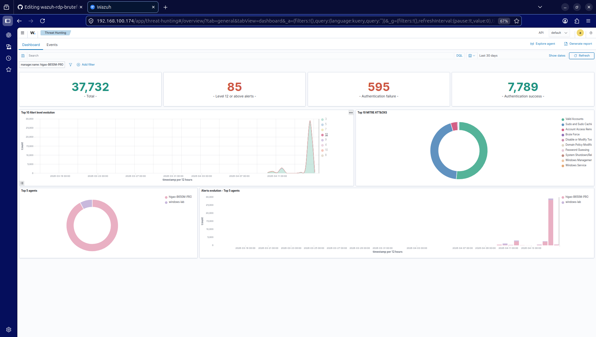
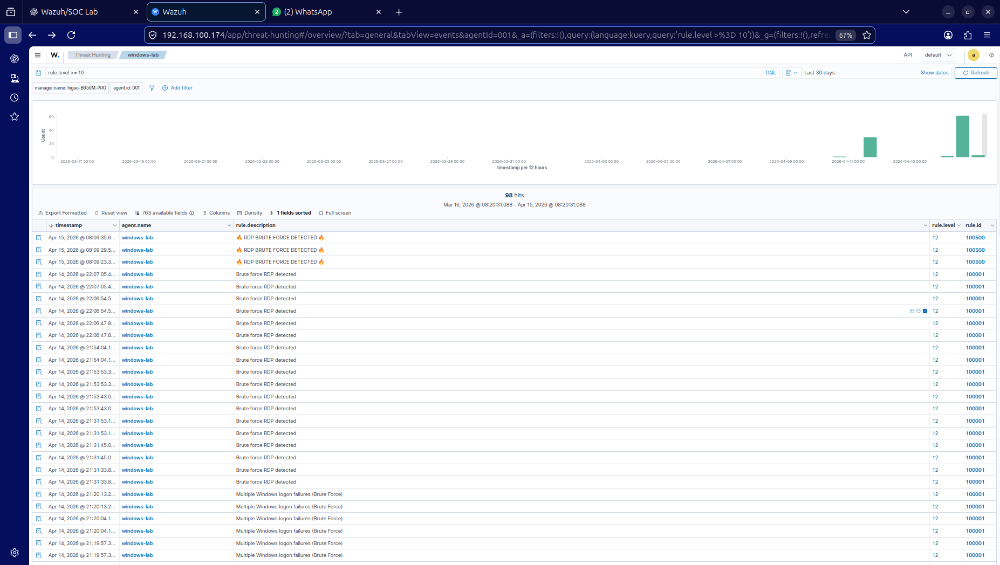
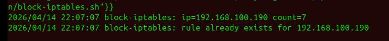
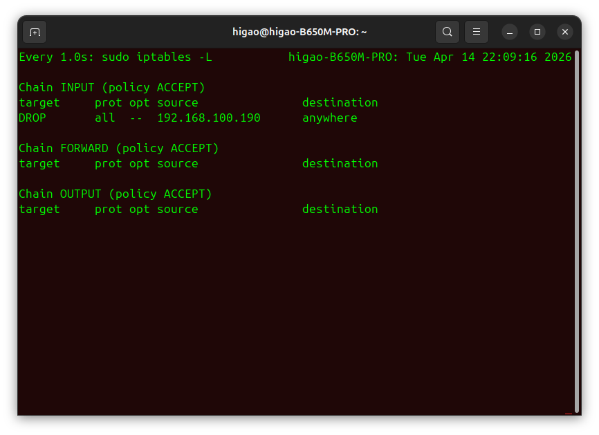

#  🚨 RDP Brute Force Detection & Automated Response (SOC Lab)


##  Overview

This project simulates a real-world brute force attack against a Windows machine and demonstrates how a SOC analyst detects, analyzes, and responds to the threat using SIEM (Wazuh).

The implementation includes log analysis, event correlation, alert generation, and automated incident response with real-time attacker IP blocking.

---

##  🚨 Key Features

✔️ Real-world brute force attack simulation (RDP)  
✔️ Threat detection via log correlation (Wazuh SIEM)  
✔️ High severity alert generation (Level 12)  
✔️ Automated incident response (Active Response)  
✔️ Real-time attacker IP blocking using iptables  

##  Lab Environment

Unlike most lab setups that rely on virtual machines, this project was executed using **three separate physical machines**:

* 🖥️ Desktop running Wazuh Manager (Ubuntu)
* 🖥️ Desktop running Windows (target)
* 💻 Laptop running Kali Linux (attacker)

All devices were connected through the same local network (Ethernet + Wi-Fi), providing a more realistic simulation of network traffic and attack behavior.

---

##  Architecture

*  Windows machine (RDP target + Wazuh agent)
*  Wazuh Manager (Ubuntu)
*  Kali Linux (attacker using Hydra)
*  Local network environment

---

## 🧠 SOC Skills Demonstrated

- Threat detection through log analysis  
- Event correlation and rule creation (SIEM)  
- Incident response automation  
- Security monitoring and alert investigation  
- Firewall-based threat mitigation  

---

##  Technologies Used

- Wazuh (SIEM)
- Windows Security Logs
- Kali Linux (Attacker)
- Hydra (Brute Force Tool)
- Bash scripting
- iptables (Active Response / Firewall)
- Ubuntu Linux
- Windows
  
---

##  Detection Logic

* Base rule: `60122` → Failed login attempts
* Custom rule: `100500` → Brute force detection
* Correlation:

  * Multiple failed logins
  * Same source IP
  * Time-based detection

---

##  Custom Rule

```xml
<rule id="100500" level="12" frequency="3" timeframe="120">
  <if_matched_sid>60122</if_matched_sid>
  <same_source_ip />
  <field name="win.eventdata.ipAddress">\S+</field>
  <description>  RDP BRUTE FORCE DETECTED  </description>
</rule>
```

---

##  Active Response

When a brute force attack is detected:

* The attacker IP is extracted from logs
* A custom script is executed
* The IP is blocked using iptables

---

##  Active Response Script

```bash
#!/bin/bash

read INPUT_JSON

IP=$(echo "$INPUT_JSON" | grep -oE '"ipAddress":"[^"]+"' | head -n1 | cut -d':' -f2- | tr -d '"')

/sbin/iptables -A INPUT -s "$IP" -j DROP
```

---

##  Attack Simulation

```bash
hydra -t 4 -V -l Higao -P /usr/share/wordlists/rockyou.txt rdp://<TARGET_IP>
```

---

##  Results

* Multiple failed login attempts detected
* Correlation rule triggered
* Alert level 12 generated
* Attacker IP blocked automatically
* Events visualized in Wazuh dashboard

---

##  Challenges Faced

* Rule correlation issues (`if_matched_sid`)
* JSON parsing problems (missing IP field)
* Active response not triggering
* Script debugging
* Field mapping (`win.eventdata.ipAddress`)
* Firewall configuration issues
  
---

## 📈 Possible Improvements

- Integration with IDS for network-based detection  
- Centralized logging with ELK Stack  
- Alert notifications (email/webhook)  
- Dashboard customization for SOC workflows
  
---

##  Use Case

This project represents a real SOC scenario where an analyst must identify repeated failed login attempts, correlate events, and take automated action to mitigate the threat.

The solution reduces response time and prevents unauthorized access by blocking the attacker in real time.

---

## Screenshots

The following images show the detection and automated response to an RDP brute force attack.

### Wazuh Dashboard Overview


### RDP Brute Force Attack Detection (Rule Level 12)
Multiple failed login attempts triggering Wazuh correlation rules.


### Active Response Execution (Firewall Trigger)
Wazuh triggers a custom script that blocks the attacker IP in real time.


### Attacker IP Blocked via iptables
Firewall rule automatically created to block the attacker IP.



---

## Author


Higor Bitencourt  
Cybersecurity Student | SOC / Blue Team  
[GitHub](https://github.com/HigorBitencourt)
